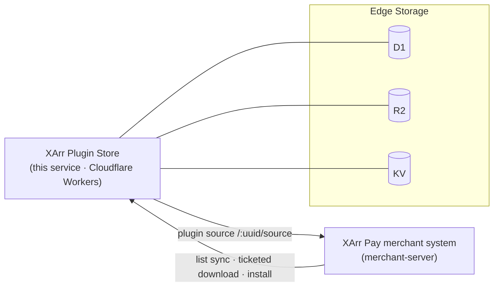

<div align="center">

# XArr Plugin Store

**XArr Ecosystem · Plugin Distribution Service**

A Cloudflare Workers backend for plugin hosting, authorized downloads, and a drop-in "plugin source" for the [XArr Pay](https://docs.xarr.cn) merchant system.

[](https://workers.cloudflare.com/)
[](https://hono.dev/)
[](#option-3--github-actions-auto-deploy)

[简体中文](README.md) · English

</div>

---

## About XArr

**XArr** is an enterprise product suite spanning the corporate website, the **XArr Pay payment system (merchant edition)**, and more — docs at [docs.xarr.cn](https://docs.xarr.cn).

**XArr Plugin Store** is its plugin-distribution component: a merchant pastes a single authorized URL into the XArr Pay console to sync and install plugins hosted by this service — centrally managed, authorized on demand, with no per-merchant packaging.



---

## Features

- 🔐 **Two-layer security** — custom admin secret path + multiple revocable download gateways + Bearer token
- 🗝️ **Zero secrets on disk** — token / admin path / gateway seed all stored as encrypted Cloudflare Secrets
- 🔌 **Plug-and-play source** — one `/source` URL connects directly to XArr Pay (list sync + ticketed download)
- 📦 **Fully offline UI** — Shoelace + fflate bundled inline, no external CDN
- ⚡ **Edge-native** — Cloudflare Workers global edge, with D1 + R2 + KV
- 🚀 **Continuous deployment** — push to `main` auto-deploys via GitHub Actions

## Tech Stack

`Cloudflare Workers` · `Hono 4` · `D1 (SQLite)` · `R2` · `KV` · `wrangler 3` · `TypeScript`

---

## Quick Start

```bash
npm install
cp wrangler.toml.example wrangler.toml   # fill in your account_id / database_id / kv id
npm run dev                              # local dev
npm test                                 # run tests
```

> Local admin secrets go in `.dev.vars` (already gitignored):
> ```
> ADMIN_TOKEN="any-local-token"
> ADMIN_PATH="console-dev"
> GATEWAY_UUID_SEED="any-local-uuid"
> ```

---

## Deployment

> ⚠️ The real `wrangler.toml` (with account/resource IDs) is gitignored and not in the repo; the repo ships `wrangler.toml.example` as a template.

### Option 1 · One-shot script (recommended for first deploy)

```bash
./node_modules/.bin/wrangler login
bash deploy.sh
```

Creates D1/KV/R2 → generates `wrangler.toml` with injected IDs → deploys → interactively sets the three Secrets → prints the admin entry, admin token, and the default download gateway.

> **Keep the admin token printed by the script safe** — it is a Secret and cannot be retrieved from config afterward.

### Option 2 · Manual

```bash
# 1. Create resources (reused if they exist); put the printed ids into wrangler.toml
./node_modules/.bin/wrangler d1 create plugin_store
./node_modules/.bin/wrangler kv namespace create KV
./node_modules/.bin/wrangler r2 bucket create plugin-store-packages

# 2. First-time schema (fresh database only; skip if you have a customized schema)
./node_modules/.bin/wrangler d1 migrations apply plugin_store --remote --config ./wrangler.toml

# 3. Deploy
./node_modules/.bin/wrangler deploy --config ./wrangler.toml

# 4. Set the three secrets (only after deploy; interactive input, not stored in shell history)
./node_modules/.bin/wrangler secret put ADMIN_TOKEN --config ./wrangler.toml
./node_modules/.bin/wrangler secret put ADMIN_PATH --config ./wrangler.toml
./node_modules/.bin/wrangler secret put GATEWAY_UUID_SEED --config ./wrangler.toml
```

> Always pass `--config ./wrangler.toml`: inside a monorepo subdirectory, omitting it may let wrangler walk up to a parent config and error out or act on the wrong Worker.

### Option 3 · GitHub Actions auto-deploy

`.github/workflows/deploy.yml` is ready: pushing to `main` deploys automatically, and you can also trigger it manually from the Actions tab. First add these under **Settings → Secrets and variables → Actions**:

| Secret | Description |
|---|---|
| `CLOUDFLARE_API_TOKEN` | Cloudflare API token (create with the "Edit Cloudflare Workers" template) |
| `CF_ACCOUNT_ID` | your account id |
| `CF_D1_DATABASE_ID` | D1 database id |
| `CF_KV_ID` | KV namespace id |

The three runtime secrets (`ADMIN_TOKEN`, etc.) are already Cloudflare Secrets — CI does **not** manage them, and the workflow does **not** run D1 migrations.

---

## Security Model

| Role | Entry | Credential |
|---|---|---|
| Admin | `GET /<ADMIN_PATH>` console login | `ADMIN_TOKEN` (Bearer) |
| Downloader | `GET /<gateway-uuid>` showcase + download | the gateway uuid itself (multiple, revocable) |
| Public | `GET /` | shows an "authorization required" notice only — no plugins listed |

Invalid paths always return 404. Download gateways are issued/revoked in the admin console.

## Connecting to XArr Pay

In the XArr Pay merchant console, set the "App Store / repository URL" to the gateway's source address:

```
https://<your-domain>/<gateway-uuid>/source
```

Refresh to sync the plugin list and install (the uuid carries authorization through the ticketed download flow).

## API Overview

| Group | Endpoints |
|---|---|
| Public | `GET /api/plugins`, `/api/plugins/:name`, `/api/plugins/:name/check-update` |
| Gateway | `GET /:uuid` (showcase), `GET /:uuid/dl/:name/:version` (authorized download) |
| Plugin source | `GET /:uuid/source`, `POST /:uuid/api/v1/download/ticket` |
| Admin | `/<ADMIN_PATH>` + Bearer: manage plugins / versions / tokens / gateways |

---

## Note: D1 migrations

`migrations/0001_init.sql` is for a **fresh database only**. If your production DB was created another way or has customized columns, **defer to the live schema** before changing it — do not blindly apply the migration file, to avoid schema conflicts.

## Docs

- Design doc: [`docs/superpowers/specs/2026-06-07-cf-plugin-store-design.md`](docs/superpowers/specs/2026-06-07-cf-plugin-store-design.md)
- XArr product docs: [docs.xarr.cn](https://docs.xarr.cn)
